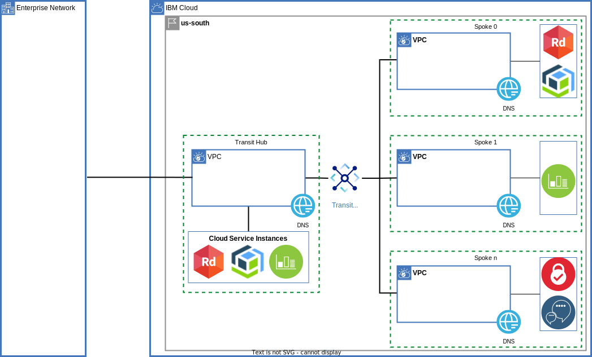
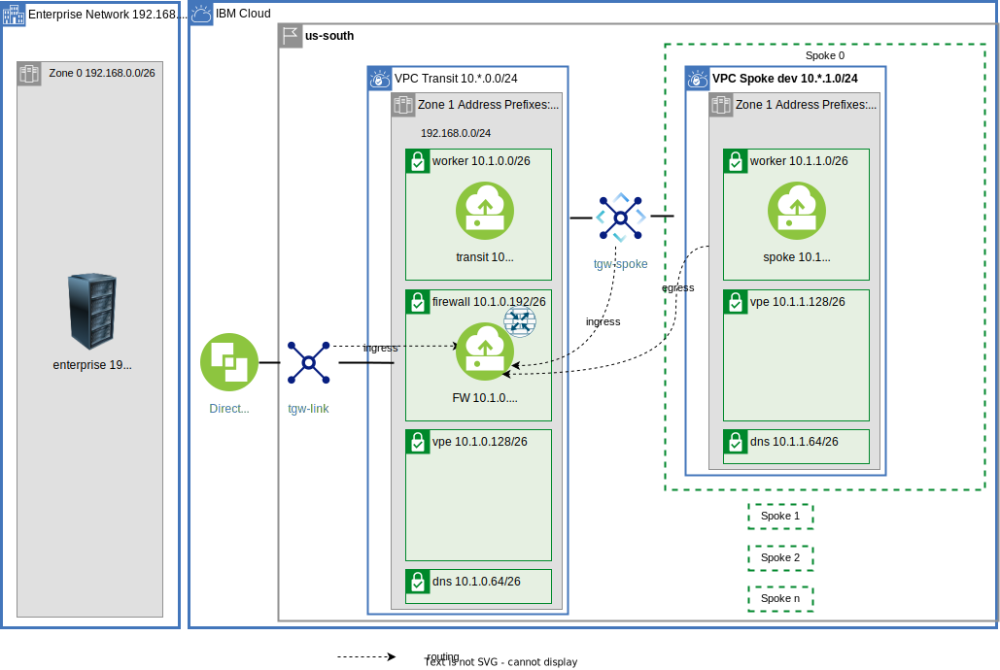
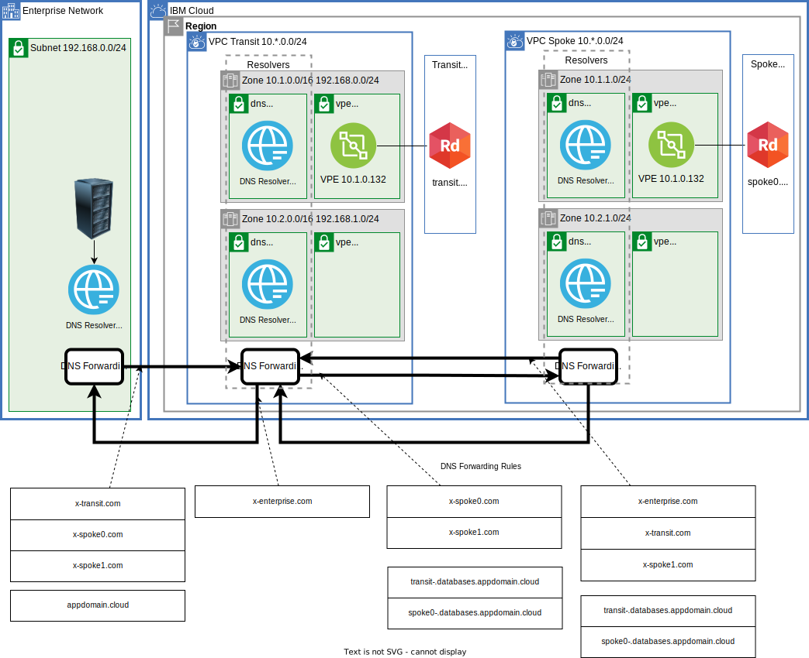

# Transit VPC Hub and Spoke
This is the companion repository for an IBM Solution tutorial [part one](https://cloud.ibm.com/docs/solution-tutorials?topic=solution-tutorials-vpc-transit1) and [part two](https://cloud.ibm.com/docs/solution-tutorials?topic=solution-tutorials-vpc-transit2). The Virtual Private Cloud, VPC, is used to securely manage network traffic in the cloud. VPCs can also be used as a way to encapsulate functionality. The VPCs can be connected to each other using Transit Gateway.

The hub will also be connected to an enterprise data center. A hub and spoke VPC model can serve a multitude of purposes.




# TLDR;
Insure python virtual environment and terraform are available or docker as described in the prerequisite section below. 
Terraform and a python environment are required on your desktop development environment. In the IBM Cloud you must [enable IP spoofing checks](https://{DomainName}/docs/vpc?topic=vpc-ip-spoofing-about#ip-spoofing-enable-check) and have a VPC ssh key.

```sh
git clone https://github.com/IBM-Cloud/vpc-transit
cd vpc-transit
cp config_tf/template.terraform.tfvars config_tf/terraform.tfvars
```

Make required changes to terraform.tfvars

```sh
edit config_tf/terraform.tfvars
```

Terraform will use your API key:
```sh
export IBMCLOUD_API_KEY=YourAPIKEy
```

Apply the layers described in the tutorial. First get a list of the layers:
```sh
apply -p
```

Apply the layers. Follow along in the tutorial to understand what each layer is accomplishing. Or just install them all:

```sh
apply -p : :
```

Then test the results. It is expected that some tests will fail. See the tutorial for details:

```sh
pytest -m curl
```

See more details on pytest below.

# Prerequisites
Terraform and a python environment are required on your desktop development environment.

In the IBM Cloud the firewall-router instance will [allow_ip_spoofing](https://{DomainName}/docs/vpc?topic=vpc-ip-spoofing-about). You must [enable IP spoofing checks](https://{DomainName}/docs/vpc?topic=vpc-ip-spoofing-about#ip-spoofing-enable-check). You need an SSH key to connect to the virtual servers. If you don't have an SSH key, see [the instructions](/docs/vpc?topic=vpc-ssh-keys) for creating a key for VPC. 

## Docker image
A docker image can be created based on the [python image](https://hub.docker.com/_/python) and the [terraform linux Ubuntu/Debian install instructions](https://developer.hashicorp.com/terraform/tutorials/aws-get-started/install-cli)

- Build docker image:
```sh
cd docker
cp ../requirements.txt .
docker build -t tools:latest .
rm requirements.txt
cd ..
```

Run the image just built interactively:
```sh
docker run -it --rm -v `pwd`:/usr/src/app  -w /usr/src/app tools bash
```

Should look like this:
```sh
root@12c27abecdbc:/usr/src/app# ./apply.sh -h
./apply.sh [-?] [-h] [-d] [-p] (start | : ) | (end | : )
apply or destroy the resources in this example by steping into each of the terraform directories in a predfined order
-? - this message
-h - this message
-p - just print the directories that would be visited do not do anything
...
```

The steps in the tutorial - `./apply.sh` and `pytest` - can now be executed in the running docker container.

# Diagrams
See the full set of diagrams and commentary in [part one](https://cloud.ibm.com/docs/solution-tutorials?topic=solution-tutorials-vpc-transit1) and [part two](https://cloud.ibm.com/docs/solution-tutorials?topic=solution-tutorials-vpc-transit2). Here are some important ones.

A single zone:



DNS:




## Python prerequisite
Python is used for testing.  You can skip the testing steps and trust the pass/fail results described in the tutorial.

You can use the docker image described above.

Or use a local version of python.

- Check version of python3 and verify it is 3.6.8 or later:
```
python --version
```
- If you have an old version of python you must install a newer version.  One way is to use [pyenv](https://github.com/pyenv/pyenv) to install the latest version of python.
- In the directory of the cloned repository create a fresh python virtual environment to persist the required libraries:
```
python3 -m venv venv --prompt transit_vpc
```
- Activate the virtual environment.  This will need to be done each time a new terminal shell is initialized.  Mac or Linux:
```sh
source venv/bin/activate
```

Windows:
```sh
source venv/Scripts/activate
```

- Upgrade to the latest version of pip.
```sh
pip install --upgrade pip
```
- Install the required python libraries into the virtual environment:
```sh
pip install -r requirements.txt
```

## Terraform
Use the docker image described above, or find instructions to download and install terraform in the [Getting started with tutorials](https://{DomainName}/docs/solution-tutorials?topic=solution-tutorials-tutorials) guide.


# Note about ssh keys
An additional temporary IBM Cloud VPC ssh key will be created in the config_tf layer and the private key contents are in `config_tf/id_rsa`. The pytest framework will use this ssh key to ssh to the instances. The VPC ssh key will be destroyed when the resources are destroyed.

Each VPC Virtual Service Instance will have two VPC ssh keys: temporary key and the key provided in `config_tf/terraform.tfvars`. This allows the pytest to run tests without additional configuration and for you to poke around in any of the instances by simply using your normal ssh procedures.

# Pytest
## Pytest marks and filtering
The python test suite is in py/test_transit.py. There is some configuration in [pytest.ini](pytest.ini).

The code expects a ssh private key in `./config_tf/id_rsa` ~/.ssh/id_rsa. This was created by `./apply.sh config_tf`.

Each test will ssh to a VSI and then perform some kind of test: curl, ping, ... to a remote instance. The pytest.ini has marks for each class of tests:
- ping: ping test
- curl: curl test
- dns: dns test
- vpe: vpe test
- vpedns: vpedns test
- lb: loadbalancer test

There is also a mark for each zone for the `left` which is the VSI that is the ssh target and the `right` which is the remote VSI or VPE that is being tested:
- lz1: left zone1 test
- lz2: left zone2 test
- lz3: left zone3 test
- rz1: right zone1 test
- rz2: right zone2 test
- rz3: right zone3 test

The --co, collect only, can also be specified to see the tests that will be run. Remove the --co flag to collect and then run the tests. For example see the curl tests on zone 1 accessing only targets in zone 1:

```sh
pytest -m 'lz1 and rz1' --co
```

Try some other combinations:

```sh
pytest -m 'curl and lz1 and rz2' --co
```

You can also use the -k flag to filter the collection even more. For example if you want to collect only the curl test from (enterprise zone 1) -> (spoke0 zone 1):

```sh
pytest -m 'curl' -k 'l-enterprise-z1 and r-spoke0-z1' --co
```

## test names

Example test run:
```sh
root@ac4518168076:/usr/src/app# pytest -m "curl and lz1 and rz1"
================================= test session starts ==================================
platform linux -- Python 3.11.1, pytest-7.2.1, pluggy-1.0.0 -- /usr/local/bin/python
cachedir: .pytest_cache
rootdir: /usr/src/app, configfile: pytest.ini, testpaths: py
collected 292 items / 276 deselected / 16 selected
   
py/test_transit.py::test_curl[l-enterprise-z1 -> r-enterprise-z1] PASSED         [  6%]
...
```

The **r-** and **l-** stand for **r**ight and **l**eft. The middle part of the name identifies enterprise, transit, spoke0, spoke1, ... The z1, z2, ... identify the zone. The test will ssh to the left instance. On the left instance the connectivity to the right instance is attempted. The **test_curl** performs a curl connectivity on the left instance to the right instance.

The test `test_curl[l-enterprise-z1 -> r-transit-z1]`:
1. ssh to a test instance in enterprise zone 1
2. execute a curl to transit zone 1
3. assert the return string contains the ID of transit zone 1 to mark pass or fail

## Pytest troubleshooting
### Show IP addresses
If you find an unexpected failure use the TEST_DEBUG=1 environment variable to get more verbose output:

```sh
TEST_DEBUG=1 pytest -m 'curl' -k 'l-enterprise-z1 and r-spoke0-z1' --co
```

Here is an example:
```
root@ac4518168076:/usr/src/app# TEST_DEBUG=1 pytest -m 'curl' -k 'l-enterprise-z1 and r-spoke0-z1'  --co
================================================================= test session starts ==================================================================
platform linux -- Python 3.11.1, pytest-7.2.1, pluggy-1.0.0 -- /usr/local/bin/python
cachedir: .pytest_cache
rootdir: /usr/src/app, configfile: pytest.ini, testpaths: py
collected 292 items / 291 deselected / 1 selected

<Module py/test_transit.py>
  <Function test_curl[l-enterprise-z1 (150.240.64.113) 192.168.0.4       -> 10.1.1.4 (52.116.134.171) r-spoke0-z1]>

=================================================== 1/292 tests collected (291 deselected) in 0.30s ====================================================
```
Notes:
- 150.240.64.113 - Floating IP address of the target VSI (left). You can ssh to this VSI to reproduce the results by hand.
- 192.168.0.4 - Local IP address of the target VSI. 
- 52.116.134.171 - Floating IP address of the remote VSI. Not used in the test. You can also ssh to this VSI and run `tcpdump` to troubleshoot
- 10.1.1.4 - Local IP address of the remote VSI.

A heavily filtered example. Reproduce the test result in your own shell:

```
$ ssh root@150.240.64.113
...
root@x-enterprise-z1-s0:~# hostname -I
192.168.0.4
root@x-enterprise-z1-s0:~# curl 10.1.1.4/name
...
```
### tcpdump

Continue with previous example: listen to tcpdump on spoke0-z1 in a second shell:

```
$ ssh root@52.116.134.171
...
root@xxxx tcpdump host 192.168.0.4
```

