# DNS Sharing for VPE gateways
In has been challenging to make VPE DNS names available across an organization. In a solution tutorial the [DNS step](https://cloud.ibm.com/docs/solution-tutorials?topic=solution-tutorials-vpc-transit2#vpc-transit2-dns) captured the complexity:

{: caption="Figure 1. Difficult DNS situation" caption-side="bottom"}

Each arrow indicates the configuration that is required in the source DNS to get resolved to the target.  For example the DNS environment on premises needs four forwarding rules:

DNS Zone|DNS Resolvers
--|--
appdomain.cloud | (10.1.15.DNS, 10.2.15.DNS, 10.3.15.DNS)
x-transit.com | (10.1.15.DNS, 10.2.15.DNS, 10.3.15.DNS)
x-spoke0.com | (10.1.15.DNS, 10.2.15.DNS, 10.3.15.DNS)

That is not too bad.  The `appdomain.cloud` rule states that any of the VPE addresses in this DNS zone are simply forwarded to the transit VPC.

The configuration of the transit VPC is more complicated. The VPEs that are in the transit VPC will be available to the enterprise. For example a IBM Cloud Database for Postgresql instance might have the private DNS name like `98d4a5d6-a31e-4b20-9fae-5a39a2ba5341.c2f3lg8w0g8s0rkj98i0.private.databases.appdomain.cloud`. Since it is in the `appdomain.cloud` zone the enterprise forwarding rule will forward to the transit VPC for resolution.

Resolving the VPEs that are in the spokes are more complicated. A zone based forwarding rule is not possible. Imagine a spoke0 and spoke1 instance:

Spoke|DNS Name
--|--
0|08d4000-a31e-4b20-9fae-5a39a2ba5341.c2f3lg8w0g8s0rkj98i0.private.databases.appdomain.cloud
1|1bc4111-a31e-4b20-9fae-5a39a2ba5341.c2f3lg8w0g8s0rkj98i0.private.databases.appdomain.cloud

It is impossible to create zone based forwarding rule in the transit VPC for the spoke instances. Individual forwarding rules must be created for each of the spoke instances. Here is the simplest custom resolver forwarding rules that has only one spoke and one database instance:

A portion of the forwarding rules would need to be replicated in each of the spokes for instances in the other spokes and instances in the transit. If there were 100s of service instances for databases, object storage, ... keeping this up to date would be complicated.

This is where DNS sharing for VPE gateways can help out

# Configuring DNS sharing

Ensure that DNS resolution binding (allow_dns_resolution) is disabled on redundant or conflicting VPEs on the DNS-shared VPCs. By default, the DNS resolution binding switch is enabled on VPEs.

