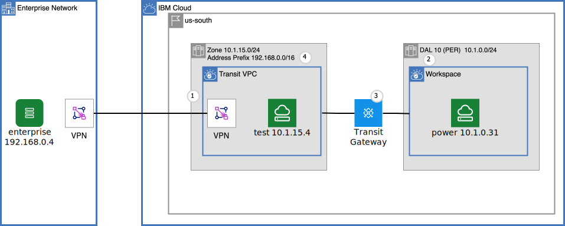
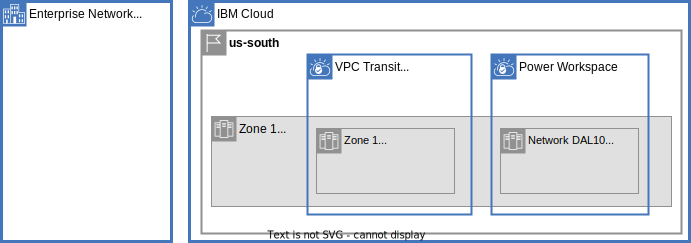

# Create a IBM PowerVS environment and connect to your enterprise via site-to-site VPN for VPC

## Introduction
The same Power servers that power your business on premises are available in PowerVS workspaces in the IBM Cloud.  Use these on demand resources to explore new possibilities, enable development and test environments or extend your production environment. Consumption based pricing means you pay for only what you use and cloud elasticity allows for the expansion and contraction of your cloud footprint based on business needs.

This tutorial will introduce VPC VPN to connect the IBM Cloud to on premises and then manually walk through the steps of creating a PowerVS workspace and connecting it to the VPN network through a Transit gateway.

The architecture is captured in Figure 1.

{: caption="Figure 1. Architecture diagram of the post" caption-side="bottom"}

`Figure 1`

The numbers in the figure are the steps to create the architecture. There is a section for each step below.

1. Create a transit VPC and VPN
1. Create a PowerVS environment
1. Create a Transit Gateway and connect to both the transit VPC and PowerVS workspace
1. Create VPC Address Prefix in transit VPC


## Plan the non overlapping CIDRs
Find more information on [Power Systems communication through a transit VPC](https://cloud.ibm.com/docs/solution-tutorials?topic=solution-tutorials-vpc-transit-power) in the tutorial.  A primary concern is to carefully define the non overlapping CIDR blocks as shown in figure 2:

{: caption="Figure 2. CIDR blocks" caption-side="bottom"}

`Figure 2`

# 1. Create a transit VPC and VPN
The solution tutorial [Power Systems communication through a transit VPC](https://cloud.ibm.com/docs/solution-tutorials?topic=solution-tutorials-vpc-transit-power) captures a number of concerns that may be of interest to PowerVS users in the IBM Cloud.  This tutorial is going to focus on just the bidirectional connectivity between on-premises instances and PowerVS instances through a VPN for VPC connection.


This tutorial will simulate the on-premises environment with a VPC which is connected to a second transit VPC using a VPN gateway connection. It will only take a few minutes to set up using the scripts provided int the [companion repository](https://github.com/IBM-Cloud/vpc-transit).

Follow the prerequisite instructions:
- Install terraform
- Obtain an IBM Cloud Identity and Access Management (IAM) [API Key](https://test.cloud.ibm.com/iam/apikeys)

Here are an abbreviated set of instructions. Export your API key for terraform usage:
```sh
export IBMCLOUD_API_KEY=YourAPIKEY
```

Clone the repo and initialize the teraform.tfvars file from the power template configured to connect the enterprise VPC to the transit VPC using VPN:
```
git clone https://github.com/IBM-Cloud/vpc-transit
cd vpc-transit
cp config_tf/template.blog_powervs.terraform.tfvars config_tf/terraform.tfvars
```

Make required changes to terraform.tfvars. This tutorial requires a data center that supports [Power Edge Router](https://cloud.ibm.com/docs/power-iaas?topic=power-iaas-per) in a region that supports VPC as defined in the table in [Creating a Power Virtual Server](https://cloud.ibm.com/docs/power-iaas?topic=power-iaas-creating-power-virtual-server)

The tutorial assumes Dallas (us-south), with VPC zone us-south-1 and PowerVS datacenter Dallas 10 (dal10). To use a different region, zone and datacenter make the associated changes as defined in the table.

```sh
edit config_tf/terraform.tfvars
```

Apply just a few of the initial layers to create only the enterprise VPC, transit VPC some test virtual server instances and the VPN connection between the enterprise and transit VPC. Note the `:` in the first command it is not a typo.

```sh
export IBMCLOUD_API_KEY=YourAPIKEY
./apply.sh : test_instances_tf
./apply.sh enterprise_link_tf
```

Open the [Virtual server instances for VPC](https://cloud.ibm.com/vpc-ext/compute/vs) and note the enterprise floating IP addresses which will be referred to as $EFIP (Enterprise Floating IP) later in the tutorial. Something like the following, but your IP address will be different.

``` sh
EFIP=150.240.164.54
```

It will be handy to keep these in a temporary file to copy/paste into the shell in later steps.

# 1. Create PowerVS environment

In this step a PowerVS workspace, ssh key, subnet and instance will be created.

1. Follow the initial instructions here [Create a PowerVS Workspace](https://cloud.ibm.com/docs/power-iaas?topic=power-iaas-creating-power-virtual-server). The steps are:
   1. Log in to the [IBM catalog](https://cloud.ibm.com/catalog) with your credentials.
   1. In the catalog's search box, type `Power Virtual Server` and click the Workspace for Power Virtual Server tile.
   1. Click Create workspace.
   1. Select a Power Edge Router **Data Center** in the same region as the VPC as described above like **Dallas 10**.
   1. Enter `blog` in the **Name** field.
   1. Select the same resource group configured in terraform.tfvars configured above.
   1. Take defaults for the other parameters
   1. Click **Finish**
   1. Click **Agree**
   1. Click **Create**
   1. Wait for the workspace to become **Active**, you may need to hit the refresh button.
1. Select the Workspace on the left in the drop-down.
1. Click SSH keys on the left navigation.
   1. Click **Create SSH key**.
   1. Enter `tmp` into the **Key name**.
   1. Copy the contents of the file config_tf/id_rsa.pub into the **Public key** text box. This file was created by the **apply.sh** script.
   1. Click **Add SSH key**
1. Click **Subnets** under **Networking** in the left navigation.
   1. Click **Create subnet**.
   1. Type `private` for the **Name**.
   1. Type `10.1.0.0/24` for the CIDR for zone 1 (defined above in the Plan the non overlapping CIDR section).
   1. Leave the rest defaults.
1. Click **Virtual server instances** under **Compute** in the left navigation. Click **Create instance**
   1. In the General section:
      1. Type `powerprivate` for the **Instance name**
      1. Click the **SSH key** drop down and select the `tmp` ssh key created earlier.
      1. Leave the rest defaults.
      1. Click Continue.
   1. In the Boot image section:
      1. For the **Operating system** click `AIX`
      1. In Image select `7200-05-06`
      1. Leave the rest defaults.
      1. Click Continue.
   1. In the Profile section:
      1. For the **Machine type** click the top item
      1. Leave the rest defaults.
      1. Click Continue.
   1. In the Storage volumes section:
      1. Leave all as defaults.
      1. Click Continue.
   1. In the Network interfaces.
      1. Keep public network **Off**.
      1. In Private networks click **Attach**.
         1. In Existing networks select **private** that was created earlier.
         1. Leave the rest defaults.
         1. Click **Attach**.
      1. Click **Finish**.
   1. Click **Agree**.
   1. Click **Create**.
   1. Wait for the instance to become **Active**, you may need to hit the refresh button.

Note the **IPs** address for virtual server instance just created. It is the IP on the private subnet which will be referred to as $PPIP (Power Private IP) later in the tutorial. Something like the following, but your IP could be different.

``` sh
PPIP=10.1.0.246
```

# 3. Create a Transit Gateway and connect to both the transit VPC and PowerVS workspace

Open the [Transit Gateway](https://cloud.ibm.com/interconnectivity/transit) list.

1. Click **Create transit gateway**
1. Set the **Transit gateway name** to `powertransit`
1. Set the **Resource group** to the one used for the resources above
1. Select **Local routing**
1. Select the **Location** in the dropdown to match the VPC, like Dallas.
1. In Connections for Connection 1 chose **Network connection** VPC.
1. Choose **Region**, like `Dallas`
1. In the **Select VPC** dropdown choose the `transit` vpc.
1. Leave **Prefix filterning** unchanged
1. Click **Add connection**
1. Click **Power Systems Virtual Server**
1. Click the **Location** to match the location of the PowerVS created above, like Dallas 10
1. Click the **Available connections** dropdown to select the Power Systems Virtual Server workspace `blog`
1. Click **Create**

It is possible to see the list or routes for the transit gateay:
1. Select **Routes** from the top tab
1. Click **Generate report**

The report shows:
- 10.1.0.0/24 - connection to the transit VPC.
- 10.1.15.0/24 - connection to the PowerVS workspace.

But the 192.168.0.0/24 route to the on-premises enterprise is missing! This means that transit gateway will not route traffic destined to an enterprise instance, like 192.168.0.4, from the PowerVS connection to the transit VPC.

This will be fixed in the next section.

# 4. Create VPC Address Prefix in transit VPC

The Transit gateway needs to learn the CIDR blocks on each of the connections. It will learn VPC CIDR blocks from `VPC Address prefixes`. 

Open [Virtual private clouds](https://cloud.ibm.com/vpc-ext/network/vpcs).

1. Click on the transit VPC name
1. In the **Address prefixes** section notice 10.1.15.0/24
1. Click **Manage address prefixes**
1. In the Address prefix table click **Create**
1. Enter `192.168.0.0/24` in the IP range
1. Enter the REGION-1 zone for example `Dallas-1` in the **Location** drop down
1. Click **Create**

Verify that transit gateway has learned the route by generating a new route report as described in the previous section.

# Test

It is now possible to ssh to the enterprise test Virtual server instance and verify connectivity. Make sure that the current working directory is the directory created with the git command earlier, and where the ./apply command was executed. Use the EFIP and PPIP values defined earlier in an experience like this one:

``` sh
.../vpc-transit % EFIP=a
.../vpc-transit % PPIP=b
.../vpc-transit % ssh -i config_tf/id_rsa root@$EFIP
...
*** System restart required ***
Last login: Tue Mar  5 14:25:23 2024 from 50.53.29.176
root@abc-enterprise-z1-worker:~#
```

You can ping the powerVS instance:

```
root@abc-enterprise-z1-worker:~# PPIP=b
root@abc-enterprise-z1-worker:~# ping $PPIP
PING 10.1.0.217 (10.1.0.217) 56(84) bytes of data.
64 bytes from 10.1.0.217: icmp_seq=1 ttl=22 time=3.37 ms
64 bytes from 10.1.0.217: icmp_seq=2 ttl=22 time=1.46 ms
```

Exit the enterprise test instance by typing `<control>C` and return back to the shell on your personal workstation.

You can use the `ssh` command to jump through the enterprise directly to the PowerVS instance. This command is a little complicated:

``` sh
ssh -oProxyCommand="ssh -W %h:%p -i config_tf/id_rsa root@$EFIP" -i config_tf/id_rsa root@$PPIP
```
# Clean up
Delete the Transit gateway:
1. Open the [Transit gateways](https://cloud.ibm.com/interconnectivity/transit)
1. Click on the name of the transit gateway.
1. On each of the connections in the table click the ellipses menu in the instance row of the table and choose `Delete`.
1. In the **Actions** drop down menu in the upper right choose `Delete`

Delete the PowerVS resources
1. Open the workspace
1. Click on **Virtual server instances** on the left navigation
1. Click the ellipses menu in the instance row of the table and choose `Delete`.
1. Click on the **Subnets** on the left navigation under **Networking**
1. Click the ellipses menu in the instance row of the table and choose `Delete`.
1. Click the **Workspaces** in the left navigation
1. Click the ellipses menu in the instance row of the table and choose `Delete`


Delete the VPN and simulated enterprise from the working directory.

```sh
./apply.sh -d enterprise_link_tf
./apply.sh -d : test_instances_tf
```

# Conclusion
Businesses looking to expand their IBM Power Virtual footprint using the latest technology can start today. Use the cloud for testing, disaster recovery and production. Create and delete servers as needed and only pay for what you use.

Read the [Power Systems communication through a transit VPC
](https://cloud.ibm.com/docs/solution-tutorials?topic=solution-tutorials-vpc-transit-power) and learn how to leverage IBM Cloud fully managed services like Databases and Cloud Object Storage.